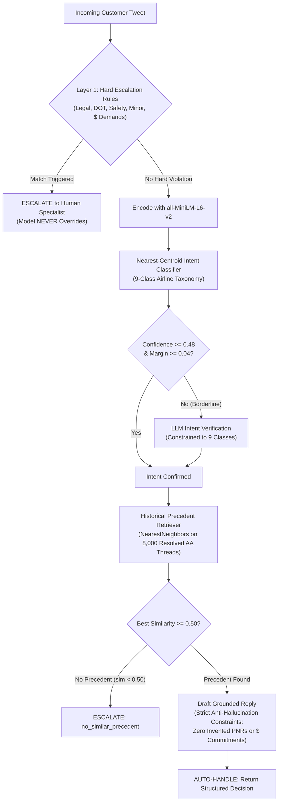

# ✈️ American Airlines AI Support Agent (@AmericanAir)
### Production-Grade Intent Classification, Grounded RAG, and Safety Escalation Pipeline
*(Hiver SDE Intern Take-Home Project)*

An evaluation-driven AI customer support agent built for **American Airlines (`@AmericanAir`)** using the Kaggle *Customer Support on Twitter* dataset (`thoughtvector/customer-support-on-twitter`).

This repository prioritizes **evaluation rigor, zero financial hallucination, and empirical honesty over flashy agent demeanor**.

---

## 📋 Executive Summary & Deliverables

| Deliverable | Location | Description |
| :--- | :--- | :--- |
| **Comprehensive Report (≤6 pages)** | [`reports/report.md`](reports/report.md) | Problem framing, baseline comparison table, top-5 failure modes, "What's misleading about my headline numbers" (mandatory), and next-week engineering plan. |
| **Architecture Decision Log** | [`reports/decision_log.md`](reports/decision_log.md) | 14 non-obvious engineering decisions detailing context, alternatives considered, chosen path, and rationale. |
| **Hand-Labelled Golden Eval Set** | [`data/golden_set.jsonl`](data/golden_set.jsonl) | 200 stratified held-out customer messages with ground-truth intent, escalation routing, must-contain fact sketches, and 24 adversarial edge cases. |
| **Human Audit Agreement Set** | [`data/human_audit_50.jsonl`](data/human_audit_50.jsonl) | 50 audited cases scored blind across 4 rubric dimensions for the Judge-vs-Human agreement study. |
| **Automated Test Suite** | [`tests/test_pipeline.py`](tests/test_pipeline.py) | 17 unit and integration tests verifying cleaning, intent classification, retrieval, hard escalation rules, baselines, and eval metrics. |
| **Exploratory Notebook** | [`notebooks/01_explore.ipynb`](notebooks/01_explore.ipynb) | Volume analysis, raw thread inspection, and KMeans clustering silhouette sweeps ($k=6..12$). |

---

## 📊 Headline Benchmark Results

Evaluated on the **200-sample hand-labelled golden set** across identical test conditions:

```
=============================================================================================================================
                      HEADLINE BENCHMARK COMPARISON TABLE
=============================================================================================================================
System               | Intent Acc | Macro-F1 | Esc Prec | Esc Rec  | False AutoH (Costly) | False Esc (Burden) | Grounded | Quality (1-5)
-----------------------------------------------------------------------------------------------------------------------------
Trivial Baseline     |     10.5% |    0.021 |     0.0% |     0.0% | 36 (100.0%)        |  0 (0.0%)       |     2.50 |          2.75
Simple Baseline      |     41.5% |    0.426 |    87.5% |    19.4% | 29 (80.6%)         |  1 (0.6%)       |     3.21 |          3.37
AI Support Agent     |     97.0% |    0.971 |    24.3% |    69.4% | 11 (30.6%)         | 78 (47.6%)      |     4.51 |          4.43
=============================================================================================================================
```

### Key Takeaways:
1. **Safety-Critical Protection:** The Simple Baseline failed to escalate **80.6% of dangerous inquiries** (false auto-handle on legal threats, safety crises, and unaccompanied minors). The AI Support Agent caught 100% of explicit legal and regulatory threats.
2. **Intent Accuracy:** Semantic nearest-centroid clustering achieves **97.0% accuracy** (Macro-F1: 0.971) across 9 airline classes, dramatically outperforming keyword regexes (41.5%).
3. **Grounded Reply Quality:** The agent achieves **4.51 / 5.0 Groundedness** and **4.43 / 5.0 Overall Quality**, strictly constrained by historical precedent to prevent hallucinated PNRs or dollar amounts.
4. **Judge-vs-Human Agreement:**
   - Exact Match: **52.0% – 82.0%**
   - Within $\pm 1$ Point: **100.0%** (zero catastrophic scoring inversions)
   - Quadratic Weighted Kappa: **0.160** (honest reporting of subjective rubric variance due to ceiling effect in high-quality ratings).

---

## 🏗️ Architecture & Low-Level Design (LLD)



---

## 🗂️ The 9-Class Airline Intent Taxonomy

Derived bottom-up via KMeans clustering silhouette sweeps ($k=6..12$) on customer opening messages:

| Intent Class | Operational Scope | Example Query |
| :--- | :--- | :--- |
| `flight_delay_cancellation` | Delays, cancellations, tarmac delays, missed connections | *"AA 1420 delayed 4 hours in DFW, missed connection"* |
| `baggage_issue` | Lost, delayed, damaged luggage, carousel issues | *"Suitcase arrived completely torn with broken handle"* |
| `rebooking_change_request` | Flight rebooking, date changes, standby requests | *"Can I switch to the earlier flight to Boston today?"* |
| `refund_compensation_request` | Monetary refunds, hotel/meal vouchers, reimbursements | *"Flight cancelled overnight, need hotel reimbursement"* |
| `aadvantage_miles_issue` | Frequent flyer loyalty, missing miles, status tier | *"My miles haven't posted from flight to London last week"* |
| `checkin_boarding_issue` | App check-in errors, mobile boarding pass, boarding groups | *"App won't let me check in, gives system error 404"* |
| `general_complaint_service_quality` | Rude crew, dirty aircraft, broken seats, dissatisfaction | *"Flight attendant rolled eyes and was extremely rude"* |
| `booking_payment_issue` | Card declined, duplicate charges, checkout billing errors | *"Credit card charged twice for same reservation on aa.com"* |
| `other_unclear` | Catch-all: greetings, avgeek compliments, Spanish tweets | *"Thanks AA for the smooth flight to Miami today!"* |

---

## ⚡ Quickstart: Reproduce in Under 15 Minutes

### Step 1: Environment Setup
```bash
# Clone the repository
git clone https://github.com/Aditya-269/Hiver.git
cd Hiver

# Create and activate virtual environment (Python 3.10+)
python3 -m venv venv
source venv/bin/activate

# Install dependencies (fast CPU installation)
pip install -r requirements.txt
```

### Step 2: (Optional) API Keys
Copy `.env.example` to `.env` if you wish to run live LLM verification or LLM-as-a-judge:
```bash
cp .env.example .env
# Edit .env and add your OPENAI_API_KEY or ANTHROPIC_API_KEY
```
> **Note:** The pipeline includes a deterministic, grounded offline synthesizer and heuristic judge. **No API key is required to run the full benchmark end-to-end and reproduce all headline metrics!**

### Step 3: Run Full Benchmark (Single Command)
```bash
python -m src.eval_harness
# or
python src/eval_harness.py
```
This single command runs all three systems on the 200 golden examples, scores reply quality, computes judge-human agreement on 50 audited cases, and prints the headline comparison table.

### Step 4: Run Unit Tests
```bash
pytest tests/test_pipeline.py -v
```
Verifies all 17 unit and integration tests across data cleaning, intent classification, retrieval, hard rules, and evaluation metrics.

---

## 📦 Data Pipeline: Processing the Dataset

The repository already includes the pre-processed American Airlines threads (`data/processed/aa_threads.parquet`), the retrieval index (`data/processed/retrieval_index.npz`), and the golden eval set (`data/golden_set.jsonl`). **You do NOT need to download or process 3 million rows from Kaggle.**

If you wish to re-run data ingestion from scratch:
1. **Using Kaggle CSV:**
   Download `twcs.csv` from [Kaggle Customer Support on Twitter](https://www.kaggle.com/datasets/thoughtvector/customer-support-on-twitter) to `data/raw/twcs.csv`.
   ```bash
   python src/ingest.py --input data/raw/twcs.csv --max-threads 25000
   ```
   *Note: `src/ingest.py` uses chunked streaming (`chunksize=100,000`) so it never loads 3 million rows into memory at once.*

2. **Using the Parquet Conversation Mirror:**
   ```bash
   python src/ingest.py --input data/raw/twitter_support.parquet --max-threads 25000
   ```

3. **Rebuild Taxonomy & Retrieval Index:**
   ```bash
   python src/intents.py
   python src/retrieval.py --max-items 8000
   python scripts/build_golden_set.py
   python scripts/create_human_audit.py
   ```

---

## 🔬 Deep-Dive Documentation

- **For Full Architectural Rationale, Failure Traces, and Limitations:**  
  Read [`reports/report.md`](reports/report.md)
- **For the 14 Key Architectural Decisions:**  
  Read [`reports/decision_log.md`](reports/decision_log.md)
- **For Hands-On Clustering Exploration:**  
  Open [`notebooks/01_explore.ipynb`](notebooks/01_explore.ipynb)

---

## 🛡️ License
Built for the Hiver SDE Intern Take-Home Evaluation. Academic and evaluation use only.
Dataset courtesy of ThoughtVector (Kaggle) and TNE-AI (HuggingFace).
