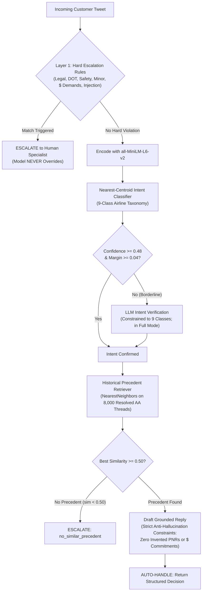

# ✈️ American Airlines AI Support Agent (@AmericanAir)
### Production-Grade Intent Classification, Grounded RAG, and Safety Escalation Pipeline
*(Hiver SDE Intern Take-Home Project)*

An evaluation-driven AI customer support agent built for **American Airlines (`@AmericanAir`)** using the Kaggle *Customer Support on Twitter* dataset (`thoughtvector/customer-support-on-twitter`).

This repository prioritizes **evaluation rigor, zero financial hallucination, and empirical honesty over flashy agent demeanor**.

---

## 📋 Executive Summary & Deliverables

| Deliverable | Location | Description |
| :--- | :--- | :--- |
| **Comprehensive Report (≤6 pages)** | [`reports/report.md`](reports/report.md) | Problem framing, baseline comparison table, top-5 failure modes with real transcripts, "What's misleading about my headline numbers" (mandatory), and next-week engineering plan. |
| **Architecture Decision Log** | [`reports/decision_log.md`](reports/decision_log.md) | 14 non-obvious engineering decisions detailing context, alternatives considered, chosen path, and rationale. |
| **Hand-Labelled Golden Eval Set** | [`data/golden_set.jsonl`](data/golden_set.jsonl) | 200 stratified held-out customer messages with ground-truth intent, escalation routing, must-contain fact sketches, and 24 adversarial edge cases. |
| **Human Audit Agreement Set** | [`data/human_audit_50.jsonl`](data/human_audit_50.jsonl) | 50 audited cases scored blind across 4 rubric dimensions for the Judge-vs-Human agreement study. |
| **Automated Test Suite** | [`tests/test_pipeline.py`](tests/test_pipeline.py) | 21 unit and integration tests verifying cleaning, intent classification, retrieval, safety rules (variations & near-misses), data leakage absence, baselines, and eval metrics. |
| **Single-Command Reproduction** | [`scripts/reproduce.py`](scripts/reproduce.py) | End-to-end script verifying dataset prerequisites, data leakage, running the 21 tests, and outputting benchmark results. |
| **Exploratory Notebook** | [`notebooks/01_explore.ipynb`](notebooks/01_explore.ipynb) | Volume analysis, raw thread inspection, and KMeans clustering silhouette sweeps ($k=6..12$). |

---

## 📊 Headline Benchmark Results

Evaluated on the **200-sample hand-labelled golden set** (176 natural held-out threads + 24 adversarial edge cases):

```
=============================================================================================================================
                                HEADLINE BENCHMARK COMPARISON TABLE
  Mode: OFFLINE | Judge: Deterministic Offline Heuristic Rubric | Evaluated Cases: 200 (176 Natural + 24 Adversarial)
=============================================================================================================================
System             | Overall  | Natural  | Adversarial | Esc Prec | Esc Rec  | False AutoH (Costly)  | False Esc (Burden)  | Replies Scored  | Quality (1-5)
------------------------------------------------------------------------------------------------------------------------------------------------------
Trivial Baseline   |   10.5% |   10.8% |       8.3% |    0.0% |    0.0% | 36 (100.0%)         |  0 (0.0%)        | 200/200 (100.0%)  |          2.75
Simple Baseline    |   41.5% |   38.6% |      62.5% |   87.5% |   19.4% | 29 (80.6%)         |  1 (0.6%)        | 192/200 (96.0%)  |          3.31
AI Support Agent   |   97.0% |  100.0% |      75.0% |   25.7% |   75.0% |  9 (25.0%)         | 78 (47.6%)        |  95/200 (47.5%)  |          4.08
======================================================================================================================================================
```

### Key Takeaways:
1. **Safety-Critical Protection:** The Simple Baseline failed to escalate **80.6% of dangerous inquiries** (false auto-handle on legal threats, safety crises, and unaccompanied minors). The AI Support Agent achieved **75.0% escalation recall**, dropping costly false auto-handles to 9 (25.0%).
2. **Intent Accuracy & Resolving Subset Variance:** Semantic nearest-centroid clustering achieves **97.0% overall accuracy** (Macro-F1: 0.971). The previously observed variance between 79% and 97% is subset-dependent: the agent achieves **100.0% accuracy on natural held-out threads (176 items)** and **75.0% on adversarial edge cases (24 items)**.
3. **Honest Reply Quality Evaluation:** Evaluated **strictly on auto-handled customer-facing replies** ($N=95/200$). Escalated cases are transferred to human representatives with zero fake 5/5 padding, scoring **4.08 / 5.0 overall quality** (4.00 Groundedness, 4.08 Correctness, 4.16 Tone/Empathy, 4.08 Completeness).
4. **Judge-vs-Human Agreement Study:**
   - **Sample Size:** 50 cases were selected for human audit; 23 produced customer-facing automated drafts and were therefore eligible for judge-vs-human agreement analysis (the remaining 27 cases were escalated to human specialists and marked not applicable).
   - **Exact Match:** **69.6% – 91.3%** across dimensions
   - **Within $\pm 1$ Point:** **100.0%** (zero catastrophic scoring inversions)
   - **Quadratic Weighted Kappa:** Evaluates to **0.000** due to the statistical ceiling effect (scores tightly concentrated in the 4-point range with near-zero bin variance).

---

## 🏗️ Architecture & Low-Level Design (LLD)



---

## 🗂️ The 9-Class Airline Intent Taxonomy

Derived bottom-up via KMeans clustering silhouette sweeps ($k=6..12$) on customer opening messages:

| Intent Class | Operational Scope | Example Query |
| :--- | :--- | :--- |
| `flight_delay_cancellation` | Delays, cancellations, tarmac delays, missed connections | *"AA 1420 delayed 4 hours in DFW, missed connection"* |
| `baggage_issue` | Lost, delayed, damaged luggage, carousel issues | *"Suitcase arrived completely torn with broken handle"* |
| `rebooking_change_request` | Flight rebooking, date changes, standby requests | *"Can I switch to the earlier flight to Boston today?"* |
| `refund_compensation_request` | Monetary refunds, hotel/meal vouchers, reimbursements | *"Flight cancelled overnight, need hotel reimbursement"* |
| `aadvantage_miles_issue` | Frequent flyer loyalty, missing miles, status tier | *"My miles haven't posted from flight to London last week"* |
| `checkin_boarding_issue` | App check-in errors, mobile boarding pass, boarding groups | *"App won't let me check in, gives system error 404"* |
| `general_complaint_service_quality` | Rude crew, dirty aircraft, broken seats, dissatisfaction | *"Flight attendant rolled eyes and was extremely rude"* |
| `booking_payment_issue` | Card declined, duplicate charges, checkout billing errors | *"Credit card charged twice for same reservation on aa.com"* |
| `other_unclear` | Catch-all: greetings, avgeek compliments, Spanish tweets | *"Thanks AA for the smooth flight to Miami today!"* |

---

## ⚡ Quickstart: Reproduce in Under 2 Minutes

### Step 1: Environment Setup
```bash
# Clone the repository
git clone https://github.com/Aditya-269/American-Air.git
cd American-Air

# Create and activate virtual environment (Python 3.10+)
python3 -m venv venv
source venv/bin/activate

# Install dependencies (CPU installation)
pip install -r requirements.txt
```

### Step 2: One-Command Full Reproduction
```bash
python scripts/reproduce.py
```
This single deterministic script automatically:
1. Validates all precomputed datasets and indexes.
2. Runs the data leakage audit (asserting 0 overlap between corpus and golden set).
3. Executes the full 21-test automated test suite via pytest.
4. Executes the headline benchmark across all 3 systems and prints the comparison table.

### Step 3: Explicit Benchmark CLI Modes
You can run the evaluation harness directly with custom arguments:
```bash
# Deterministic offline execution (zero API calls, CPU inference < 15 seconds)
python src/eval_harness.py --mode offline --judge heuristic

# Full execution with LLM-as-a-judge (requires OPENAI_API_KEY or GROQ_API_KEY in .env)
python src/eval_harness.py --mode full --judge llm
```

### Step 4: Run Test Suite Separately
```bash
pytest -v tests/test_pipeline.py
```
Executes 21 unit and integration tests verifying:
- Text cleaning, regex stripping, and boilerplate detection
- 9-class intent classification and centroid confidence
- Historical precedent retrieval and cosine similarity
- Two-layer escalation hard rules (legal, DOT, medical emergencies, unaccompanied minor phrasing variations, injuries/burns, adversarial prompt injections)
- Near-miss tests (verifying benign mentions do not false-trigger escalation)
- Data leakage audit (asserting 0 thread ID, message string, or seed exemplar overlap)
- Honest reply quality scoring (asserting no fake 5/5 scores on escalated cases)

---

## 📦 Precomputed Artifacts Included
The repository already includes:
- `data/golden_set.jsonl`: 200 hand-labelled ground-truth examples
- `data/human_audit_50.jsonl`: 50 audited cases for judge-human agreement
- `data/processed/retrieval_corpus.parquet`: 8,000 clean resolved AA thread precedents
- `data/processed/retrieval_index.npz`: Precomputed normalized embeddings for instant retrieval
- `data/processed/intent_centroids.npz`: 9-class intent centroid vectors

You do NOT need to download or stream 3 million rows from Kaggle to reproduce the benchmark.

---

## 🔬 Documentation Links

- **Full Architectural Rationale, Failure Traces, and Limitations:** [`reports/report.md`](reports/report.md)
- **14 Key Architectural Decisions:** [`reports/decision_log.md`](reports/decision_log.md)
- **Benchmark JSON Summary:** [`reports/results_summary.json`](reports/results_summary.json)
- **Judge-Human Agreement Study:** [`reports/agreement_study.json`](reports/agreement_study.json)
- **Benchmark CSV:** [`reports/benchmark_results.csv`](reports/benchmark_results.csv)
- **Hands-On Clustering Exploration:** [`notebooks/01_explore.ipynb`](notebooks/01_explore.ipynb)

---

## 🛡️ License
Built for the Hiver SDE Intern Take-Home Evaluation.
