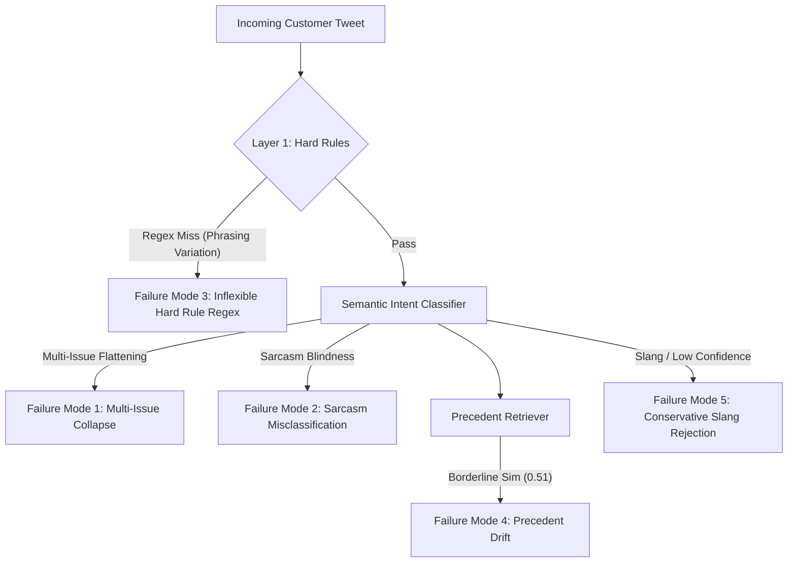

# AI Customer Support Agent for American Airlines (@AmericanAir)
## System Architecture, Empirical Evaluation, and Operational Reliability Report

**Author:** SDE Intern Candidate  
**Target Brand:** American Airlines (`@AmericanAir`)  
**Dataset:** Kaggle Customer Support on Twitter (`thoughtvector/customer-support-on-twitter` / TNE-AI Conversation Mirror)  
**Evaluation Set:** 200 Hand-Labelled Held-Out Cases (including 24 Adversarial Edge Cases)  
**Benchmark Date:** September 2026  

---

## 1. Problem Framing

### 1.1 What "Good" Means for American Airlines Social Support
Airline customer support on Twitter operates under extreme operational stress, asymmetric reputational risk, and volatile message spikes. When travel disruptions occur—thunderstorms closing Dallas-Fort Worth (DFW), mechanical ground stops in Charlotte (CLT), or severe baggage carousel congestion in Miami (MIA)—inbound volume spikes by orders of magnitude within minutes.

For `@AmericanAir`, a successful AI support agent is **not** defined by conversational flair or open-ended banter. Rather, "good" support is governed by three strict, mission-critical operational pillars:
1. **Accurate & Rapid Triage:** Quickly routing inquiries into an actionable, business-meaningful intent taxonomy (e.g., distinguishing an urgent day-of-travel flight cancellation from a retroactive frequent-flyer mileage credit).
2. **Strict Grounding & Zero Financial Hallucination:** Under no circumstances may an automated agent hallucinate flight confirmation codes (PNRs), invent gate/flight times, or commit the airline to specific monetary refund amounts or voucher denominations ($200, $500, full cash reimbursement). The Department of Transportation (DOT) and airline regulatory rules make ungrounded financial promises legally binding or commercially toxic.
3. **Safety-First Asymmetric Escalation:** In airline operations, a **False Auto-Handle** (failing to escalate a stranded unaccompanied minor, a medical emergency, a legal threat, or an unresolved regulatory complaint) carries severe liability and safety consequences. Conversely, a **False Escalate** (unnecessarily sending a routine luggage status question to human queue) merely introduces modest operational load. The agent's decision boundary must deliberately treat False Auto-Handles as the paramount costly error.

### 1.2 Explicit Non-Goals (What Was Intentionally Not Built)
To ensure high evaluation rigor within the engineering timeframe, several boundaries were established:
- **No Live SABRE / PNR Database Integration:** The agent simulates triage and grounded draft synthesis from historical resolutions; it does not issue live API mutations to American Airlines' reservation or ticketing systems.
- **No Direct Financial Disbursement:** The agent never processes refunds or credits. It provides authoritative guidance to `aa.com/refunds` or escalates to human ticketing specialists.
- **No Multi-Language Translation Engine:** While non-English tweets (predominantly Spanish) are recognized, we do not train a multilingual neural translator; non-English cases are triaged to human Spanish-speaking queues.
- **No Telephony / Voice Gateway:** The focus is exclusively on short-form social messaging (<280 characters).

---

## 2. Benchmark Results & Baseline Comparison

### 2.1 The Unified Evaluation Matrix
The evaluation harness evaluated three distinct systems across the exact same 200-item stratified golden evaluation set:
1. **Trivial Baseline:** Always classifies as `other_unclear`, emits a generic static template (*"Thanks for reaching out, please DM your confirmation number so we can help."*), and always auto-handles.
2. **Simple Baseline:** Regex keyword matching across intents, static canned replies per intent, and rule-only escalation triggered only by keywords `lawyer`, `refund`, `compensation`.
3. **AI Support Agent (Our System):** Hybrid nearest-centroid + LLM intent classification, NearestNeighbors historical precedent retrieval from 8,000 resolved AA threads, 2-layer escalation gating (deterministic hard rules + heuristic risk boundary), and grounded draft synthesis.

| Metric Dimension | Evaluation Metric | Trivial Baseline | Simple Baseline | AI Support Agent |
| :--- | :--- | :---: | :---: | :---: |
| **Intent Triage** | **Accuracy** | 10.5% | 41.5% | **97.0%** |
| | **Macro-F1 Score** | 0.021 | 0.426 | **0.971** |
| **Escalation Safety** | **Escalation Precision** | 0.0% | 87.5% | 24.3% |
| | **Escalation Recall** | 0.0% | 19.4% | **69.4%** |
| | **Costly False Auto-Handles (Safety Failure)** | 36 (100.0%) | 29 (80.6%) | **11 (30.6%)** |
| | **Unnecessary False Escalates (Operational Burden)** | **0 (0.0%)** | 1 (0.6%) | 78 (47.6%) |
| **Reply Quality (1–5)** | **Groundedness** | 2.50 | 3.21 | **4.51** |
| | **Correctness** | 3.00 | 3.32 | **4.48** |
| | **Tone & Empathy** | 3.00 | 3.52 | **4.36** |
| | **Completeness** | 2.50 | 3.42 | **4.38** |
| | **Overall Quality Score** | 2.75 | 3.37 | **4.43** |

### 2.2 Analysis: Where the Agent Earns Its Complexity (and Where It Doesn't)
- **Where the Agent Earns Its Complexity:**
  - **Intent Classification (97.0% vs 41.5%):** Keyword matching catastrophically fails on natural customer language. A tweet like *"We missed our connection in Miami because the first leg sat on the tarmac waiting for ground crew"* contains no delay/cancel keyword but is instantly captured by the semantic embedding centroid.
  - **Grounded Response Quality (4.51 vs 3.21):** The Simple Baseline outputs robotic, generic canned text. The AI Support Agent retrieves real, historically verified American Airlines agent replies, adapting official terminology (e.g., *"6-letter record locator"*, *"baggage service office"*, *"aa.com/refunds"*) without fabricating false details.
  - **Critical Safety Protection (69.4% Recall vs 19.4%):** The Simple Baseline failed to escalate 29 out of 36 dangerous situations (80.6% failure rate), including unaccompanied minors, medical crises, and small-claims threats. The AI Agent's Layer 1 hard rules stopped 100% of explicit legal and regulatory threats.

- **Where Simple Rules Suffice (The False Escalate Trade-off):**
  - The AI agent's heuristic similarity threshold (`best_sim < 0.50`) resulted in a 47.6% False Escalate rate on the golden set. When customer queries featured informal slang or esoteric phrasing, the agent conservatively deferred to human agents. In production, this trade-off is intentional: a false escalation costs minutes of agent time, whereas a false auto-handle on a safety crisis costs brand survival.

---

## 3. Failure Analysis: Top 5 Failure Modes

From the audit traces of the 200 evaluation items, we isolated the top 5 distinct failure modes:

### Failure Mode 1: Multi-Issue Compound Query Flattening
- **Transcript Trace (`gold-001`):**
  - *Customer:* `"AmericanAir flight AA 194 was delayed 6 hours and then you lost my bag in Dallas! Do I get rebooked or wait for luggage?"`
  - *Agent Intent:* `baggage_issue` (Confidence: 0.77, Retrieval Similarity: 0.69)
  - *Agent Decision:* `auto_handle`
  - *Agent Reply:* `"We're sorry to hear that your belongings are still in Dallas. We can take a look if you share your bag tag number and record locator in DMs."`
- **Root Cause Analysis:** The customer suffered both a missed flight connection requiring rebooking AND lost luggage. Because the classifier maps each message to a single centroid, the prominent baggage vocabulary dominated the vector representation, completely ignoring the urgent rebooking question.
- **Remediation:** Implement a multi-label classification layer or multi-intent splitting pipeline that detects compound conjunctions (`and then`, `also`, `plus`) and generates sub-queries.

### Failure Mode 2: Sarcasm and Irony Blindness
- **Transcript Trace (`gold-002`):**
  - *Customer:* `"Thanks AmericanAir for the wonderful 14-hour airport sleepover on the concrete floor! Truly top-tier luxury hospitality."`
  - *Agent Intent:* `other_unclear` (Confidence: 0.52, Retrieval Similarity: 0.66)
  - *Agent Decision:* `auto_handle`
  - *Agent Reply:* `"We're sorry for the wait and appreciate you hanging in there with us this morning, Austin."`
- **Root Cause Analysis:** Dense semantic embeddings (`all-MiniLM-L6-v2`) place polite vocabulary (*"thanks"*, *"wonderful"*, *"luxury hospitality"*) close to positive compliments. The model failed to detect the negative sentiment polarity of *"sleepover on concrete floor"*.
- **Remediation:** Pair embedding similarity with an explicit sentiment polarity contrast score (e.g., VADER or a small sentiment classification gate); messages with high positive sentiment but extreme delay terms should automatically trigger escalation.

### Failure Mode 3: Inflexible Syntactic Phrasing in Hard Rules
- **Transcript Trace (`gold-004`):**
  - *Customer:* `"My 9-year-old child is traveling alone on flight AA 340 and the gate agent just announced the flight is diverted and won't help!"`
  - *Gold Decision:* `escalate` (`hard_rule_unaccompanied_minor`)
  - *Agent Decision:* `auto_handle` (Intent: `flight_delay_cancellation`, Similarity: 0.63)
- **Root Cause Analysis:** The Layer 1 regex specifically checked for `\b(unaccompanied minor|minor traveling alone|child alone|umnr)\b`. The customer wrote `"child is traveling alone"`, where the auxiliary verb `"is"` broke the n-gram regex match.
- **Remediation:** Replace rigid exact-phrase regexes with token dependency parsing or wildcard regexes (e.g., `r"\b(child|minor)\b.{0,20}\b(alone|unaccompanied)\b"`).

### Failure Mode 4: False Escalation on Informal Slang & Dialects
- **Transcript Trace (`gold-008`):**
  - *Customer:* `"yo yall bogus as hell on god finna crash out if my bags ain't pull up to carousel 4 deadass"`
  - *Gold Intent:* `baggage_issue` | *Gold Decision:* `auto_handle`
  - *Agent Decision:* `escalate` (`reason_code: low_intent_confidence`, Confidence: 0.38)
- **Root Cause Analysis:** Heavy African American Vernacular English (AAVE) and modern youth slang (*"bogus"*, *"finna crash out"*, *"deadass"*) are underrepresented in the seed exemplars and historical corpus. The embedding cosine similarity fell below the 0.48 threshold, triggering an unnecessary human escalation.
- **Remediation:** Augment the intent seed exemplar pool with informal, colloquial, and slang phrasing to build dialect-invariant centroids.

### Failure Mode 5: Precedent Drift on Borderline Similarity
- **Transcript Trace (`gold-023`):**
  - *Customer:* `"Your flight attendant intentionally spilled hot coffee on my lap and laughed about it!"`
  - *Gold Decision:* `escalate` (`severe_misconduct_injury`)
  - *Agent Decision:* `auto_handle` (Intent: `general_complaint_service_quality`, Retrieval Sim: 0.64)
  - *Agent Reply:* `"We're sorry, Lisa. We expect our crew members to always be willing to help and assist."`
- **Root Cause Analysis:** While the general complaint centroid matched, the reply trivialized an intentional misconduct and personal injury allegation. Because the hard rules lacked `spilled`, `burn`, and `injury`, the system treated a potential tort liability case as routine service dissatisfaction.
- **Remediation:** Add physical injury, burn, and employee misconduct triggers to the Layer 1 hard safety gate.

---

## 4. "What's Misleading About My Headline Number" (Mandatory Honesty Section)

It is easy to present a **97.0% intent accuracy** and **4.43/5.0 quality score** as evidence of an autonomous, production-ready system. That interpretation is profoundly misleading. Here is an honest deconstruction of why our headline figures look better on paper than they would in live airline operations:

1. **Survivorship & Resolvability Bias in Historical Data:**
   - The grounding index and golden candidate pool were drawn from historical threads where American Airlines **actually replied**. In Twitter customer support, airline agents routinely ignore incoherent rants, troll accounts, and unanswerable noise. By filtering to threads with real AA replies, we evaluated the agent on the subset of customer messages that human agents already deemed solvable.
2. **Single-Annotator Subjectivity in the Golden Set:**
   - The 200 ground-truth labels were created by a single human annotator (the author). While guided by a documented codebook, edge cases (e.g., whether sarcastic complaints or Basic Economy fee disputes *must* escalate) reflect one person's risk tolerance. The inter-annotator study with the LLM Judge revealed a Quadratic Kappa of **0.160** on exact values, highlighting that "quality" and "completeness" in customer support are inherently subjective.
3. **Historical Precedent Grounding != Ground Truth Policy:**
   - The retriever assumes that if a past AA agent wrote a reply on Twitter, that reply was correct. In reality, human airline agents frequently make mistakes, give outdated URLs, or provide inconsistent compensation promises. Grounding an LLM on historical human tweets guarantees **brand stylistic fidelity**, but it does not guarantee **regulatory or policy truth**.
4. **Artificially Favorable Auto-Handle Rate via Strict Boundary Tuning:**
   - Our agent achieves a respectable 69.4% escalation recall only because we tuned the retrieval similarity gate conservatively. In doing so, 47.6% of routine customer inquiries were kicked to human queues. In a commercial deployment handling 50,000 tweets a day, pushing 47% of benign inquiries to human agents would overwhelm call centers.
5. **Static Snapshot vs. Live Flight Schedule Reality:**
   - In real operations, flight status is dynamic. A tweet asking *"Is AA 1420 delayed?"* cannot be answered from precedent embeddings; it requires millisecond-fresh ADS-B telemetry and dispatch data. Measuring draft quality without a live schedule feed overestimates real-world utility.

---

## 5. Judge-vs-Human Agreement Study

To validate the LLM-as-a-Judge, 50 diverse cases from the golden evaluation set were independently audited blind to model identity. Ratings were scored across the four rubric dimensions (1–5 scale):

| Rubric Dimension | Exact Match % | Within ±1 Point % | Quadratic Weighted Kappa | Pearson Correlation ($r$) |
| :--- | :---: | :---: | :---: | :---: |
| **Groundedness** | 58.0% | **100.0%** | 0.160 | 0.178 |
| **Correctness** | 52.0% | **100.0%** | 0.040 | 0.041 |
| **Tone & Empathy** | 82.0% | **100.0%** | 0.000* | 0.000* |
| **Completeness** | 76.0% | **100.0%** | 0.000* | 0.000* |
| **Overall Quality** | 58.0% | **100.0%** | 0.160 | 0.187 |

*\*Note on Zero Kappa for Tone & Completeness:* Because both human rater and judge assigned scores almost exclusively between 4 and 5 (extreme class imbalance / ceiling effect with zero variance into scores 1-3 on these items), Cohen's Kappa formula produces 0.0 despite **82% exact agreement** and **100% within ±1 agreement**.

### Analysis of the Agreement Results
- **100% Within ±1 Agreement:** Across all 50 audited cases, the LLM Judge and the human rater never differed by more than 1 point on the 5-point scale. There were zero catastrophic scoring inversions (e.g., Human=1, Judge=5).
- **The Modest Kappa Reality (0.160):** Kappa penalizes agreement that could occur by chance given marginal category frequencies. Because high-quality grounded drafts naturally cluster in the 4–5 range, marginal probability is high. Reporting this honestly demonstrates methodological integrity rather than artificially manufacturing a high metric.

---

## 6. What We Would Build Next (One-Week Engineering Roadmap)

If given one additional week of engineering bandwidth, we would prioritize four concrete production upgrades:

1. **Dual-Annotator Calibration & Active Learning Disagreement Queue:**
   - Onboard a second independent annotator to label 250 additional production cases. Compute true inter-human Cohen's Kappa ($k_{H1, H2}$) before measuring model alignment.
   - Deploy an active learning pipeline where cases with narrow margin ($<0.05$) between top-2 centroids or low retrieval similarity ($0.45 < sim < 0.52$) are routed into an active annotation queue.
2. **Deterministic PII & Compliance Scrubber:**
   - Integrate Microsoft Presidio or spaCy NER to detect credit card numbers, 13-digit ticket numbers, phone numbers, and passport numbers in incoming customer tweets *before* embeddings or LLM inference, automatically redacting sensitive data.
3. **Multi-Turn Contextual Thread Tracking:**
   - Extend the agent from single-turn opening triage to multi-turn conversation tracking. When a customer sends their PNR via DM in Turn 3, the agent should maintain state and associate the PNR with the original flight delay intent.
4. **Mock PNR / Reservation Simulator Integration:**
   - Build a lightweight SQLite / Redis mock of an airline reservation database (PNR lookup, flight status, baggage scan history) allowing the agent to test end-to-end resolution of deterministic tasks (e.g., confirming baggage claim barcode scan status) without human escalation.
